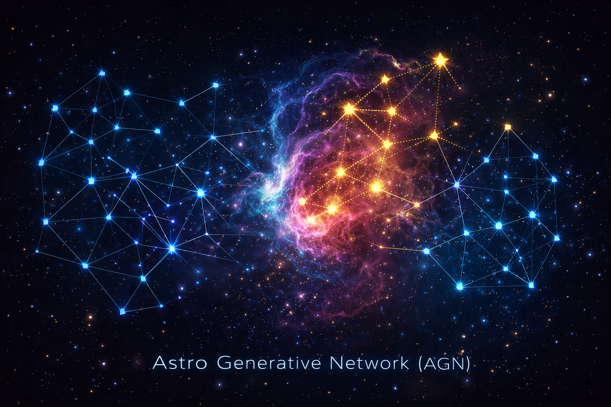

# Astro Generative Network (AGN) - Generalized Version

<p align="center">
  
</p>

**A framework for generating new nodes and edges in any network using Variational Graph Autoencoders (VGAE).**

## Overview

This project implements the Astro Generative Network (AGN) - a framework for generating new nodes and edges in any network type. The system learns from existing network data to generate new nodes with appropriate features and connects them to the network based on similarity.


## Key Features

- **General Network Support**: Works with any network type (social networks, citation networks, etc.)
- **Node Generation**: Generates new nodes with realistic features learned from the original network
- **Topology-Preserving Insertion**: Connects generated nodes to existing nodes based on feature similarity
- **Multiple Dataset Support**: Evaluated on multiple social network datasets
- **Comprehensive Evaluation**: Includes topology metrics, novelty analysis, and visualization

## Project Structure

```
AGN-General/
├── src/
│   └── agn_general/          # Main AGN module
│       ├── __init__.py
│       ├── config.py         # Configuration parameters
│       ├── data_loader.py     # Data loading for social networks
│       ├── model.py           # VGAE model architecture
│       ├── training.py        # Training loop
│       ├── generation.py      # Node generation and insertion
│       ├── evaluation.py      # Evaluation metrics and plots
│       └── main.py            # Main execution script
│
├── data/                     # Input data directory
├── results/                  # Output directory
│   ├── models/               # Trained model checkpoints
│   ├── generated/            # Generated node features
│   └── plots/                # Visualization outputs
│
├── requirements.txt          # Python dependencies
└── README.md                 # This file
```

## Installation

1. **Install dependencies:**
```bash
pip install -r requirements.txt
```

2. **Install PyTorch Geometric** (if not already installed):
```bash
pip install torch-geometric
```

## Usage

### Basic Usage

Run the main script to train and generate nodes for multiple datasets:

```bash
cd src/agn_general
python main.py
```

This will:
1. Load three social network datasets (Karate Club, Facebook Ego, Email Network)
2. Train a VGAE model on each dataset
3. Generate new nodes for each network
4. Insert generated nodes with appropriate edges
5. Evaluate and visualize results

### Configuration

Edit `config.py` to customize:

- **Model parameters**: `HIDDEN_DIM`, `LATENT_DIM`, `NUM_GCN_LAYERS`
- **Training parameters**: `EPOCHS`, `BATCH_SIZE`, `LEARNING_RATE`
- **Generation parameters**: `NUM_GENERATED_NODES`, `K_NEIGHBORS`, `SIMILARITY_THRESHOLD`
- **Dataset parameters**: `DATASET_PORTION` (fraction of dataset to use)

### Using Custom Datasets

To use your own dataset, modify `data_loader.py`:

```python
def load_custom_dataset(portion=1.0):
    # Load your network (NetworkX graph)
    G = nx.read_edgelist("your_network.edgelist")
    
    # Create node features
    features = []
    for node in G.nodes():
        feat = [
            G.degree(node),
            nx.clustering(G, node),
            # Add your custom features here
        ]
        features.append(feat)
    
    features = np.array(features, dtype=np.float32)
    
    # Convert to PyTorch Geometric format
    data = from_networkx(G)
    data.x = torch.tensor(features, dtype=torch.float32)
    data.edge_index = to_undirected(data.edge_index)
    
    return G, features, data.edge_index
```

## How It Works

### 1. Model Architecture

The AGN uses a **Variational Graph Autoencoder (VGAE)**:

- **Encoder**: Graph Convolutional Network (GCN) that encodes nodes into latent space
- **Decoder**: Neural network that generates node features from latent vectors
- **Edge Decoder**: Inner product decoder for edge prediction

### 2. Training Process

1. The model learns to encode existing nodes into a latent space
2. It learns to reconstruct node features and edges from latent representations
3. Training uses a combination of reconstruction loss and KL divergence

### 3. Generation Process

1. Sample latent vectors from the learned distribution
2. Decode latent vectors to generate new node features
3. Compute similarity between generated and original nodes
4. Connect generated nodes to top-k most similar original nodes
5. Optionally connect generated nodes to each other

### 4. Evaluation

The system evaluates:
- **Topology metrics**: Degree distribution, clustering coefficient, path length
- **Novelty analysis**: Distance between generated and original nodes
- **Visualization**: Network plots, PCA visualization, degree distributions

## Output

Results are saved in the `results/` directory:

- **`models/best_agn_model.pth`**: Trained model checkpoint
- **`generated/generated_nodes.csv`**: Generated node features
- **`plots/`**: Visualization plots including:
  - Network comparison (before/after)
  - Degree distribution comparison
  - PCA visualization
  - Novelty analysis plots

## Supported Datasets

Currently supports:
1. **Karate Club**: Zachary's Karate Club network
2. **Facebook Ego**: Synthetic social network with community structure
3. **Email Network**: Scale-free network (Barabási-Albert)

## Citation

If you use this code, please cite:

```bibtex
@article{agn2024,
  title={Astro Generative Network: A Framework for Network Node Generation},
  author={Your Name},
  journal={Computer Science Journal},
  year={2024}
}
```

## Dependencies

- PyTorch >= 1.9.0
- PyTorch Geometric >= 2.0.0
- NetworkX >= 2.6.0
- NumPy >= 1.21.0
- scikit-learn >= 1.0.0
- Matplotlib >= 3.4.0

## License

[Specify your license here]

## Contact

[Your contact information]
